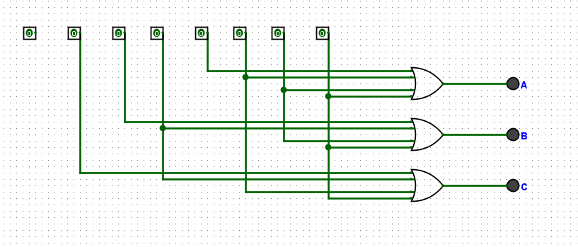
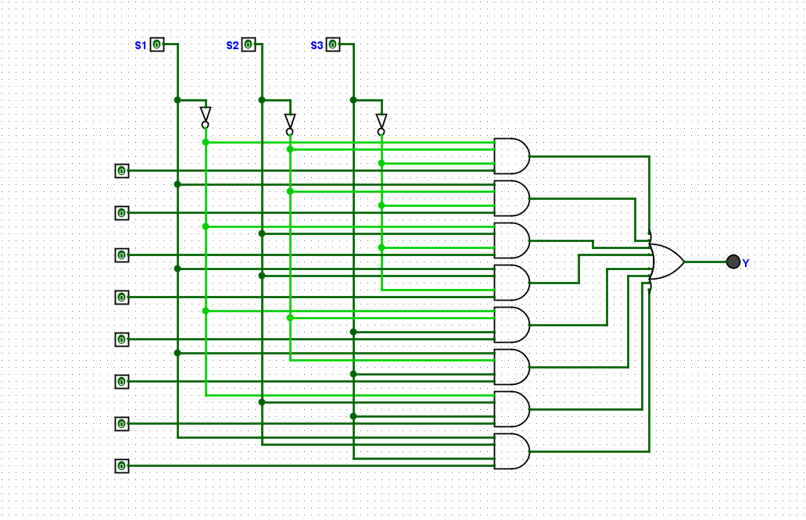

**Experiment Title**:

Design and Simulation of 8×3 Encoder and 8×1 Multiplexer Using Logisim

**Aim**:

To design, implement, and simulate an 8×3 encoder and an 8×1 multiplexer using Logisim software, and to verify their truth tables and functionality through simulation.

**Software Used**:

Logisim (A graphical tool for designing and simulating digital logic circuits)

**Theory**:

*Encoder (8×3)*

An encoder is a combinational circuit that converts 2ⁿ input lines into n output lines. An 8×3 encoder has:
• 8 input lines (D₀ to D₇)
• 3 output lines (A, B, C)

Only one input is active (high) at a time, and the output represents the binary code of the active input's position.

Truth Table:

| D₇ | D₆ | D₅ | D₄ | D₃ | D₂ | D₁ | D₀ | A | B | C |
|----|----|----|----|----|----|----|----|----|----|----|
| 0 | 0 | 0 | 0 | 0 | 0 | 0 | 1 | 0 | 0 | 0 |
| 0 | 0 | 0 | 0 | 0 | 0 | 1 | 0 | 0 | 0 | 1 |
| 0 | 0 | 0 | 0 | 0 | 1 | 0 | 0 | 0 | 1 | 0 |
| 0 | 0 | 0 | 0 | 1 | 0 | 0 | 0 | 0 | 1 | 1 |
| 0 | 0 | 0 | 1 | 0 | 0 | 0 | 0 | 1 | 0 | 0 |
| 0 | 0 | 1 | 0 | 0 | 0 | 0 | 0 | 1 | 0 | 1 |
| 0 | 1 | 0 | 0 | 0 | 0 | 0 | 0 | 1 | 1 | 0 |
| 1 | 0 | 0 | 0 | 0 | 0 | 0 | 0 | 1 | 1 | 1 |

Boolean Expressions:
• $$A = D4 + D5 + D6 + D7$$
• $$B = D2 + D3 + D6 + D7$$
• $$C = D1 + D3 + D5 + D7$$

*Multiplexer (8×1)*

A multiplexer (MUX) is a combinational circuit that selects one of several input signals and forwards it to a single output line. An 8×1 multiplexer has:
• 8 data inputs (I₀ to I₇)
• 3 select lines (S₁, S₂, S₃)
• 1 output (Y)

The select lines determine which input is routed to the output.

Boolean Expression:

$$Y = \sum{i=0}^{7} (Ii \cdot mi)$$

where $$mi$$ is the minterm corresponding to the select combination.

Truth Table:

| S2 | S1 | S0 | Selected Input | Output (Y) |
|----|----|----|----------------|------------|
| 0  | 0  | 0  | I0             | I0         |
| 0  | 0  | 1  | I1             | I1         |
| 0  | 1  | 0  | I2             | I2         |
| 0  | 1  | 1  | I3             | I3         |
| 1  | 0  | 0  | I4             | I4         |
| 1  | 0  | 1  | I5             | I5         |
| 1  | 1  | 0  | I6             | I6         |
| 1  | 1  | 1  | I7             | I7         |

**Components Required**

| Component | Quantity |
|-----------|----------|
| OR Gates | 3 (for encoder) |
| AND Gates | 8 (for MUX) |
| NOT Gates | 3 (for MUX select inversion) |
| Input Pins | As required |
| Output Pins | As required |
| Wires | As required |

**Procedure**:

8×3 Encoder:

Open Logisim and create a new project.

Place 8 input pins labeled D₀ through D₇.

Place 3 output pins labeled A, B, and C.

Connect inputs to OR gates according to the Boolean expressions.

Wire OR gate outputs to the corresponding output pins.

Simulate by setting one input HIGH at a time and verifying outputs.

8×1 Multiplexer:

Create a new circuit in the same project.

Place 8 data input pins (I₀–I₇) and 3 select input pins (S₁, S₂, S₃).

Add NOT gates to generate complements of select lines.

Place 8 AND gates (4-input each) — one for each data input.

Connect each AND gate to the appropriate data input and select line combination.

Connect all AND gate outputs to a single OR gate.

Wire the OR gate output to the output pin Y.

Simulate by varying select lines and verifying output matches the selected input.

**Circuit Diagrams**:

*Encoder (8×3)*

*Multiplexer (8×1)*

**Observations and Result**:

| Experiment | Input Condition | Expected Output | Observed Output | Status |
|------------|-----------------|-----------------|-----------------|--------|
| Encoder | D₃ = 1, others = 0 | A=0, B=1, C=1 | A=0, B=1, C=1 | Verified |
| MUX | S=011, I₃=1 | Y=1 | Y=1 | Verified |

**Conclusion**:

The 8×3 encoder and 8×1 multiplexer were successfully designed and simulated using Logisim. The simulation outputs matched the expected values from the truth tables, confirming correct circuit design. This experiment reinforced understanding of combinational logic design, Boolean algebra implementation, and digital circuit simulation.
