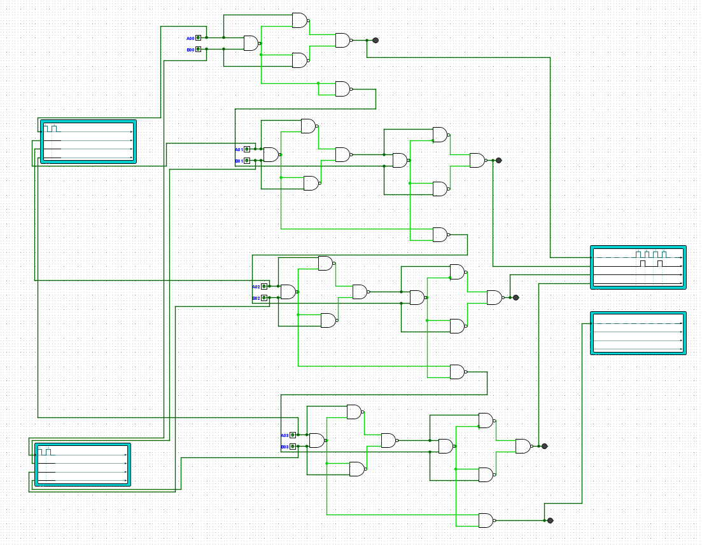
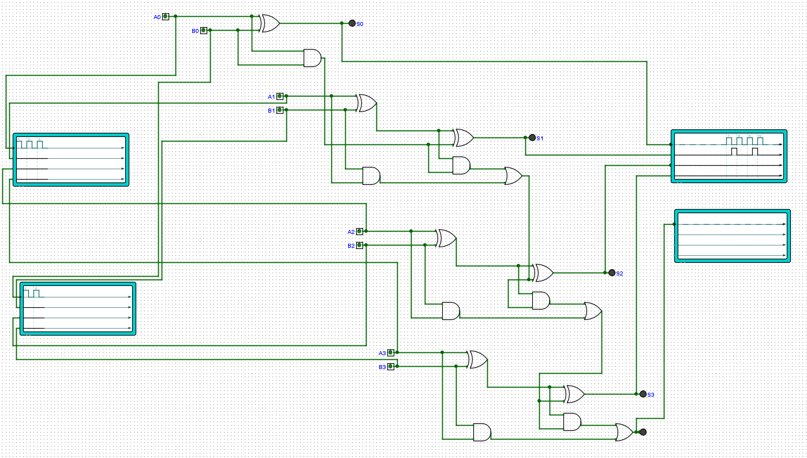

**Experiment Title**:

Design and Implementation of a 4-Bit Binary Adder Using Exclusive Gates (XOR) and Universal Gates (NAND/NOR) in Logisim

**Aim**:

To design, simulate, and verify a 4-bit binary adder circuit using exclusive gates (XOR) and universal gates (NAND/NOR) in Logisim software, and to understand the working principle of ripple carry addition at the gate level.

**Software Used**:

Logisim (A graphical tool for designing and simulating digital logic circuits)

**Theory**:

*Full Adder*

A full adder adds three single-bit binary numbers (two inputs and a carry-in). Outputs:
• Sum: $$S = A \oplus B \oplus C{in}$$
• Carry Out: $$C{out} = (A \cdot B) + (C{in} \cdot (A \oplus B))$$

| A | B | Cin | Sum | Cout |
|---|---|-----|-----|------|
| 0 | 0 |  0  |  0  |   0  |
| 0 | 0 |  1  |  1  |   0  |
| 0 | 1 |  0  |  1  |   0  |
| 0 | 1 |  1  |  0  |   1  |
| 1 | 0 |  0  |  1  |   0  |
| 1 | 0 |  1  |  0  |   1  |
| 1 | 1 |  0  |  0  |   1  |
| 1 | 1 |  1  |  1  |   1  |

*4-Bit Binary Adder (Ripple Carry Adder)*

A 4-bit adder chains four full adders, with the carry output of each stage connected to the carry input of the next. This allows addition of two 4-bit binary numbers, producing a 4-bit sum and a carry out.

*Universal Gates*

NAND and NOR gates are called universal gates because any logic function can be implemented using only NAND or only NOR gates. The adder circuits can be constructed entirely from these gates.

*Exclusive Gates*

XOR and XNOR gates are particularly efficient for arithmetic operations. XOR directly implements the sum function, making adder design more compact.

**Components Used**:

| Component         | Quantity |
|-------------------|----------|
| XOR Gate          | 8        |
| AND Gate          | 8        |
| OR Gate           | 4        |
| NAND Gate         | (as used) |
| NOR Gate          | (as used) |
| Input Pins (A, B) | 8        |
| Output Pins (S)   | 4        |
| Carry Output      | 1        |
| Wires             | As required |

**Procedure**:

- Open Logisim and create a new project.
- Design a single-bit full adder using XOR, AND, and OR gates (or equivalent NAND/NOR implementation).
- Replicate the full adder module four times.
- Connect the carry-out of each adder to the carry-in of the next (ripple carry configuration).
- Label inputs as A0–A3 and B0–B3; label outputs as S0–S3 and Cout.
- Add waveform analyzers or probes to observe input/output signals.
- Apply various input combinations and verify the output against expected results.

**Circuit Diagrams**:

**Test Cases**:

| A (4-bit) | B (4-bit) | Expected Sum | Cout |
|-----------|-----------|--------------|------|
| 0000      | 0000      | 0000         | 0    |
| 0001      | 0001      | 0010         | 0    |
| 0101      | 0011      | 1000         | 0    |
| 1111      | 0001      | 0000         | 1    |
| 1010      | 0101      | 1111         | 0    |
| 1111      | 1111      | 1110         | 1    |

**Observations**:

- The sum outputs (S0–S3) correctly reflected the binary addition of inputs A and B.
- The carry propagates correctly through each full adder stage.
- Waveform outputs (shown in screenshots) confirm expected timing and logic levels.

**Result**:

The 4-bit binary adder was successfully designed and simulated in Logisim using XOR and universal gates. All test cases produced correct sum and carry outputs, verifying the functionality of the ripple carry adder.

**Conclusion**:

- The experiment demonstrated the design of a combinational circuit for binary addition.
- XOR gates efficiently generate the sum, while AND/OR (or NAND/NOR) gates handle carry propagation.
- Understanding gate-level implementation reinforces concepts of digital arithmetic and lays the foundation for ALU design.

**Author**:

Arth Singh Chauhan
(241210023)
