**Experiment Title:**

Analysis of Pointers, Memory Management, and Registers using GDB

**Aim**:

To study and analyze Pointer behavior in C, Memory management (stack, heap, data segment) and CPU registers and execution flow using the GDB Debugger

**Software Used:**

C Programming Language, GCC Compiler (`gcc`), GDB Debugger and Visual Studio Code / Terminal

**Theory:**

*Pointers in C*

A pointer stores the memory address of another variable.

* `&` → Address-of operator
* `*` → Dereference operator

Example:

```c
int a = 5;
int *p = &a;
```

*Memory Management*

A C program uses different memory segments:

* Stack - Local variables, function calls
* Heap - Dynamic memory (`malloc`, `free`)
* Data Segment - Global/static variables
* Code Segment - Program instructions

*CPU Registers*

Registers are high-speed memory inside CPU:

* `EAX, EBX, ECX, EDX` → General purpose
* `ESP` → Stack pointer
* `EBP` → Base pointer
* `EIP` → Instruction pointer

*GDB Debugger*

GDB allows:

* Step-by-step execution
* Breakpoints
* Register inspection
* Memory analysis


**Program Code:**

*Part A*

```c
#include <stdio.h>

int main() {
    int int_var = 5;
    int *int_ptr;

    int_ptr = &int_var; // Put the address of int_var into int_ptr

    printf("int_var = %d\n&int_var = %p\n\n", int_var, &int_var);
    printf("int_ptr = %p\n&int_ptr = %p\n*int_ptr = %d\n\n", int_ptr, &int_ptr, *int_ptr);

    *int_ptr = 10; // Change the value via the pointer

    printf("int_var = %d\n&int_var = %p\n\n", int_var, &int_var);
    printf("int_ptr = %p\n&int_ptr = %p\n*int_ptr = %d\n", int_ptr, &int_ptr, *int_ptr);

    return 0;
}
```

*Part B*

```c
#include <stdio.h>
#include <stdlib.h>

int global = 3; // Global Segment

int main() {
    char hello[] = "hello";   // Stack (Array)
    char* hello2 = "hello2";  // Value is in Text, Pointer is on Stack
    
    int* p = malloc(10);      // Allocated on Heap

    printf("hello=   %p\n", (void*)hello);
    printf("hello2=  %p\n", (void*)hello2);
    printf("&hello2= %p\n", (void*)&hello2);
    
    printf("main=    %p\n", (void*)main);
    printf("&global= %p\n", (void*)&global);
    printf("p=       %p\n", (void*)p);

    free(p);
    return 0;
}
```


**Procedure:**

*Part A*

* Write pointer program
* Compile:

  ```bash
  gcc -g pointer.c -o pointer
  ```
* Run:

  ```bash
  ./pointer
  ```
* Observe:

  * Variable values
  * Memory addresses
  * Pointer dereferencing

*Part B*

* Compile program:

  ```bash
  gcc -g assignment.c -o assignment
  ```
* Start GDB:

  ```bash
  gdb ./assignment
  ```
* Execute commands:

  * `break main` → Set breakpoint
  * `run` → Start execution
  * `n` → Step execution
  * `info registers` → View registers
  * `print &var` → Address of variable
  * `print p` → Pointer value
  * `x` → Examine memory


**Output & Debugging:**

*Part A*

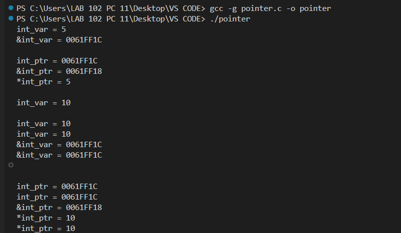

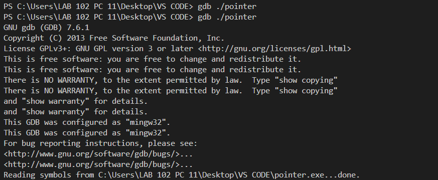

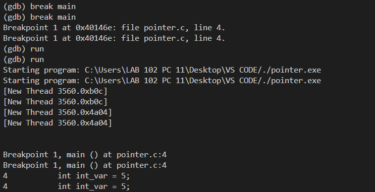

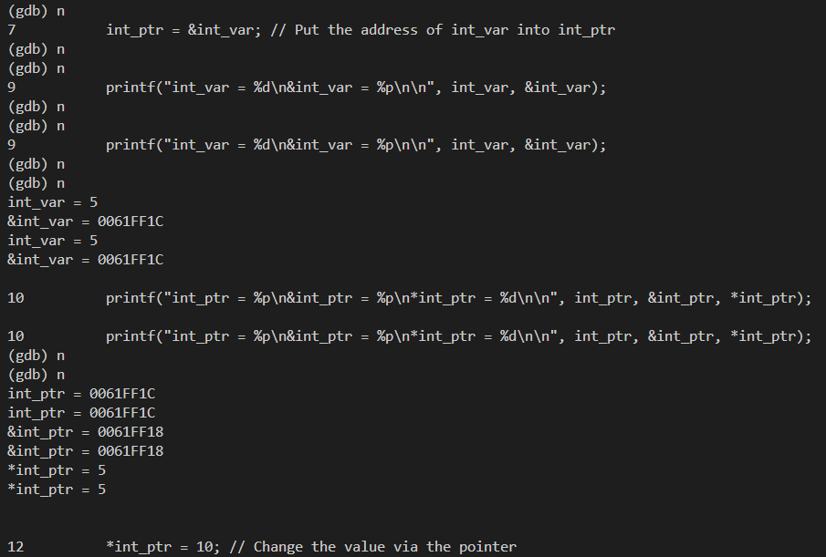

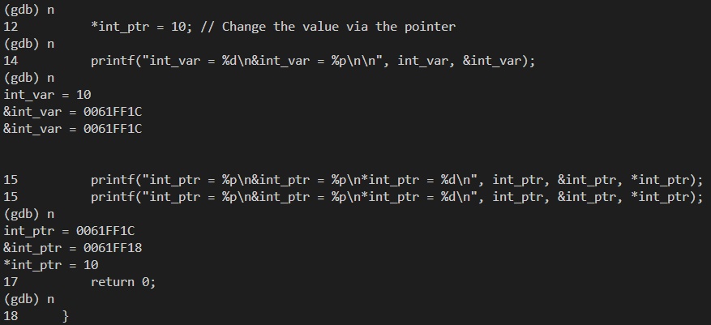

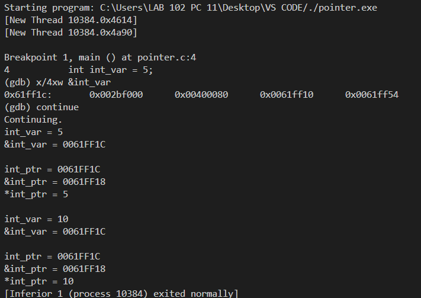


*Part B*

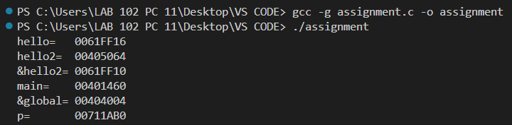

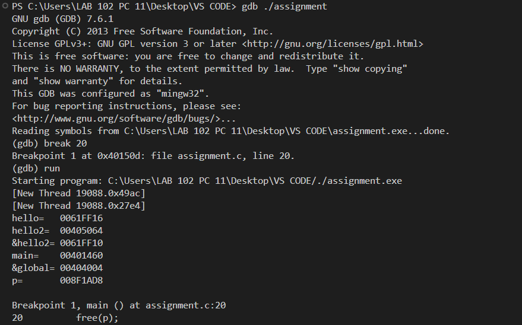

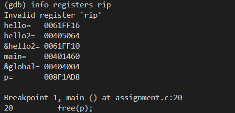

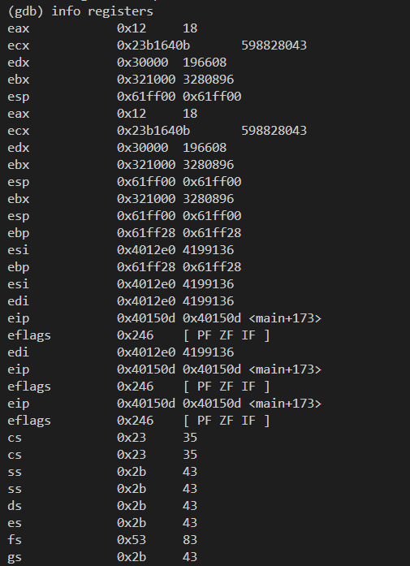

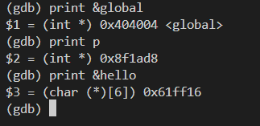


**Observations:**

* Pointer stores address of variable
* Dereferencing accesses actual value
* Changing `*ptr` updates original variable
* Stack stores local variables
* Heap stores dynamically allocated memory
* Global variables stored in data segment
* Registers control execution flow
* `EIP` shows current instruction


**Result:**

* Successfully demonstrated pointer operations
* Observed memory allocation in stack, heap, and data segments
* Analyzed CPU registers using GDB
* Verified program execution step-by-step


**Conclusion:**

This experiment provided a comprehensive understanding of pointers, memory organization, and CPU registers. Using GDB debugger, the internal working of program execution was analyzed effectively, helping in understanding how memory and registers interact during execution.

