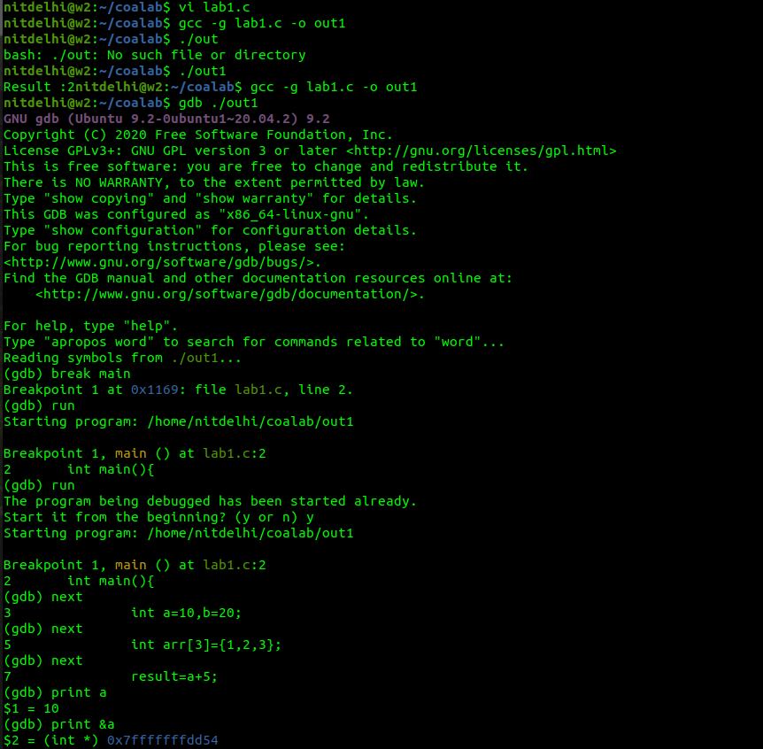
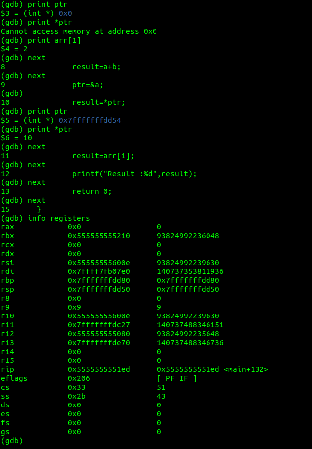
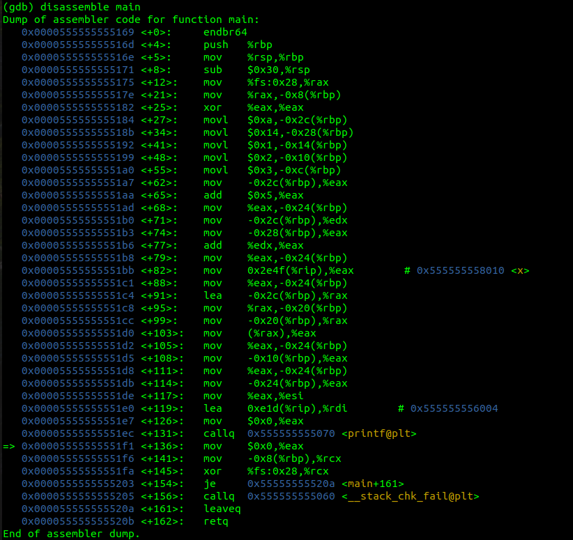

**Experiment Title:**

Study of Addressing Modes using C Programs and GDB Debugger

**Aim**:

To study and analyze different addressing modes of instructions by executing C programs and observing their behavior using the GDB debugger.

**Software Used:**

C Programming Language, GCC Compiler (`gcc`), GDB Debugger and Linux Terminal / VS Code


**Theory:**

*Addressing Modes*

Addressing modes define how operands are accessed by instructions during execution.

*1. Immediate Addressing Mode*

In this mode, the operand value is directly specified in the instruction itself. No memory access is required to fetch the operand.

Example:

```c
result = a + 5;
```

Explanation:

* The value `5` is directly used
* Faster execution since no extra memory access is needed

*2. Direct Addressing Mode*

In direct addressing, the instruction contains the address of the operand (variable). The CPU directly accesses that memory location.

Example:

```c
result = a + b;
```

Explanation:

* Values of variables `a` and `b` are accessed directly
* Requires memory access to fetch operand

*3. Indirect Addressing Mode*

In indirect addressing, the instruction refers to a memory location that contains the address of the operand. This is commonly implemented using pointers.

Example:

```c
ptr = &a;
result = *ptr;
```

Explanation:

* `ptr` stores address of `a`
* `*ptr` accesses value stored at that address
* Provides flexibility but requires extra level of access

*4. Indexed Addressing Mode*

In indexed addressing, the effective address of the operand is calculated using a base address and an index value. This is commonly used with arrays.

Example:

```c
result = arr[1];
```

Explanation:

* Base address of array + index offset
* Useful for accessing sequential data

*5. Register Addressing Mode*

In this mode, operands are stored in CPU registers rather than memory.

Example (Conceptual):

```c
result = a + b;
```

Explanation:

* Variables may be stored in registers during execution
* Faster than memory access

*6. Register Indirect Addressing Mode*

The register contains the address of the operand rather than the operand itself.

Example (Conceptual):

```c
ptr = &a;
result = *ptr;
```

*Role of GDB*

GDB helps to:

* Execute program step-by-step
* Inspect memory and variables
* Analyze instruction execution
* View assembly code using `disassemble`


**Program Code:**

*Part A*

```c
#include <stdio.h>

int main(){
    int a=10,b=20;
    int result;
    int arr[3]={1,2,3};
    int *ptr;

    result=a+5;        // Immediate addressing
    result=a+b;        // Direct addressing
    ptr=&a;            // Indirect addressing
    result=*ptr;
    result=arr[1];     // Indexed addressing

    printf("Result : %d",result);
    return 0;
}
```

*Part B*

```c
#include <stdio.h>

int x=10;

int main(){
    int a=10,b=20;
    int result;
    int arr[3]={1,2,3};
    int *ptr;

    result=a+5;        // Immediate
    result=a+b;        // Direct
    result=x;          // Global variable (data segment)
    ptr=&a;            // Indirect
    result=*ptr;
    result=arr[1];     // Indexed

    printf("Result : %d",result);
    return 0;
}
```


**Procedure:**

* Write the C program (`lab1.c`)
* Compile with debug flag:

  ```bash
  gcc -g lab1.c -o out1
  ```
* Run program:

  ```bash
  ./out1
  ```
* Start GDB:

  ```bash
  gdb ./out1
  ```
* Execute commands:

  * `break main` → Set breakpoint
  * `run` → Start execution
  * `next` → Step execution
  * `print a` → Check variable
  * `print &a` → Address of variable
  * `print ptr` → Pointer value
  * `info registers` → CPU registers
  * `disassemble main` → View assembly


**Output & Debugging:**

*Part A*






*Part B*




**Observations:**

* Immediate values are directly embedded in instructions
* Direct addressing accesses variables stored in registers/memory
* Indirect addressing uses pointer to access memory
* Indexed addressing uses array indexing
* Global variables are stored in data segment
* GDB shows low-level execution through registers and assembly


**Result:**

* Successfully demonstrated different addressing modes
* Verified execution using GDB step-by-step debugging
* Observed how high-level C code maps to low-level instructions


**Conclusion:**

This experiment provided a clear understanding of various addressing modes and their implementation in C programs. Using GDB debugger, the execution of instructions was analyzed at a low level, helping to understand how different addressing techniques are used by the processor during program execution.
