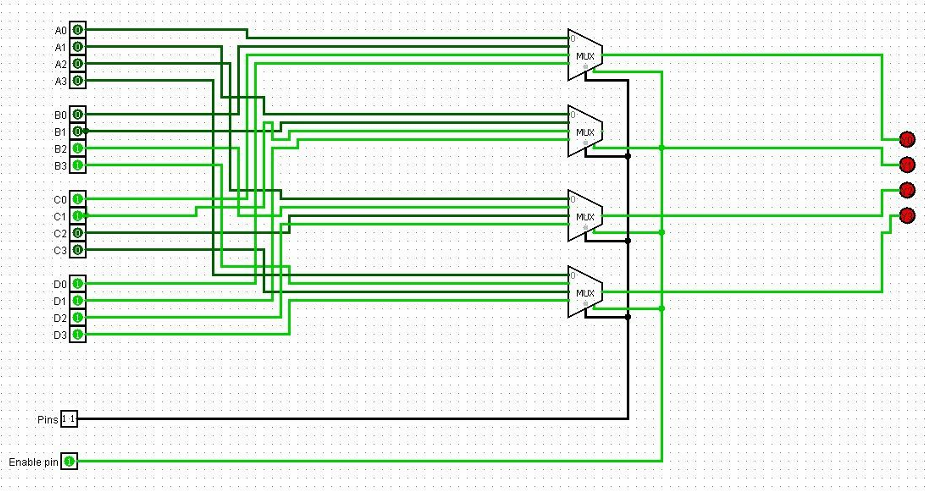

**Experiment Title**:

Design and Implementation of a 4-Bit Common Bus System using Multiplexers and Logic Gates in Logisim


**Aim**:

To design and verify the operation of a **4-bit Common Bus System** using multiplexers and basic logic gates for transferring binary data between multiple registers.


**Software Used**:

Logisim (Graphical tool for designing and simulating digital logic circuits)


**Theory**:

A **Common Bus System** is a digital communication pathway that allows data transfer among multiple registers using a shared set of lines.

In a *4-bit Common Bus System*, four parallel lines are used to transfer 4-bit binary data from one selected register to another.

*Advantages*

* Reduces the number of direct connections
* Simplifies circuit design
* Improves hardware efficiency

*Working Principle*

* Each register stores 4-bit binary data
* Selection lines choose which register is connected to the bus
* Only one register can place data on the bus at a time
* The selected data is transferred to the destination register

*Bus Operation Example*

* If *Register B* is selected:

  ```
  Bus Output = B3 B2 B1 B0
  ```

* If *Register D* is selected:

  ```
  Bus Output = D3 D2 D1 D0
  ```

*Bus Structure*

Each bus line is connected using a multiplexer:

* Bus line 0 → selects from A0, B0, C0, D0
* Bus line 1 → selects from A1, B1, C1, D1
* Bus line 2 → selects from A2, B2, C2, D2
* Bus line 3 → selects from A3, B3, C3, D3

Thus, *4 multiplexers* are required for a 4-bit bus system


**Components Used**:

* Multiple 4-bit registers (Register A, B, C, D)
* Multiplexers (MUX) or tri-state buffers
* Selection lines
* Control signals


**Procedure**:

1. Open Logisim and create a new project

2. Add **four 4-bit registers** (A, B, C, D)

3. Add **4 multiplexers (4×1 MUX)**

   * Each MUX corresponds to one bus line

4. Connect inputs:

   * MUX 0 → A0, B0, C0, D0
   * MUX 1 → A1, B1, C1, D1
   * MUX 2 → A2, B2, C2, D2
   * MUX 3 → A3, B3, C3, D3

5. Add **selection lines (S1, S0)**

   * Connect them to all multiplexers

6. Connect MUX outputs to form the **4-bit bus**

7. Apply different inputs to registers

8. Change selection lines and observe output


**Circuit Diagram**:




**Truth Table (Selection Logic)**:

| S1 | S0 | Selected Register | Bus Output  |
| -- | -- | ----------------- | ----------- |
| 0  | 0  | A                 | A3 A2 A1 A0 |
| 0  | 1  | B                 | B3 B2 B1 B0 |
| 1  | 0  | C                 | C3 C2 C1 C0 |
| 1  | 1  | D                 | D3 D2 D1 D0 |


**Observations**:

* Only one register is active on the bus at a time
* Selection lines control data transfer
* Multiplexers successfully route data to the bus
* Bus reduces wiring complexity
* Output changes correctly with selection inputs


**Result**:

The 4-bit Common Bus System was successfully designed and simulated in Logisim.
The bus correctly transferred data from selected registers based on control signals.


**Conclusion**:

This experiment demonstrated the design and working of a common bus system using multiplexers. It showed how multiple registers can share a common communication path efficiently. Understanding this concept is essential for designing data paths in CPUs and digital systems.


**Author**:

Arth Singh Chauhan
(241210023)
